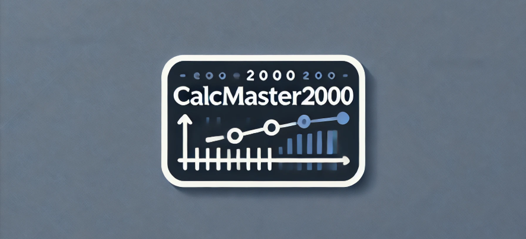

# CalcMaster2000 - your new project management tool!

## What is CalcMaster2000?
**A project calulating tool.**
CalcMaster2000 is a project management application tool built for Alpha Solutions,CalcMaster2000. It's designed to streamline task and resource allocation. It allows administrators to create, edit, and manage projects, tasks, and subtasks while tracking time estimates, costs, and employee assignments. With a user-friendly interface and database integration, the system ensures efficient project oversight and collaboration. The application is built with a focus on flexibility, scalability, and ease of use

**Who maintains and contributes to the project?** 
- ChristofferLundKea
- Celinelundm
- StringArrayLaurray

## Languages and technologies 

- **Programming Languages**:
  - Java (Azul JDK 21)
  - HTML
  - CSS
    
- **Frameworks & Libraries**:
  - Spring Data JDBC 2024.1
  - Spring Boot 3.4.0
  - Thymeleaf 3.4.0
    
- **Databases**:
  - H2 SQL (org.hibernate.dialect.H2Dialect for local development)
  - MySQL 8.0.33 (for production)
    
- **Build Tools**:
  - Maven 4.0.0 (for dependency management and build automation)
    
## Dependencies
CalcMaster2000 uses the following key dependencies:

- **Spring Boot Starter Web**: For building web applications.
- **Spring Boot Starter Thymeleaf**: For rendering dynamic HTML views.
- **Spring Boot Starter Data JDBC**: For database integration with MySQL.
- **MySQL Connector**: For connecting to the MySQL database.
- **H2 Database** (test scope): For lightweight testing with an in-memory database.
- **Spring Boot DevTools**: To improve the development workflow with live reload.

## ontribute
You are welcome contribute to the project! If you would like to help improve the project, please follow the guidelines in the CONTRIBUTE.md file.

## First time you access the site
Remember to login with username and password for the preset admin Klaus Petersen.

## Run the program locally or online
Azure link for the site: https://calcmaster2000-cedqe8bxeya0hdh4.northeurope-01.azurewebsites.net/

If you want to access the site locally on your machine (with port 8080), download the two SQL files (schema.sql and data.sql) and run them first. 

## Acknowledgements
CalcMaster2000 has been developed with a focus on core functionalities such as project management, task allocation, and resource tracking. While there is always potential for further enhancements, we prioritized delivering a product that meets essential needs within the time constraints of this project. This application represents the best we could achieve given the scope and timeframe, emphasizing simplicity, efficiency, and usability.

## Licenses
Project Portal is licensed under the [MIT LICENSE](https://github.com/ChristofferLundKEA/CalcMaster2000/blob/master/LICENSE)

## Test Coverage
Testcoverage for the project is available here: 
[Test Coverage Report](https://christofferlundkea.github.io/CalcMaster2000/test-coverage-report/)
